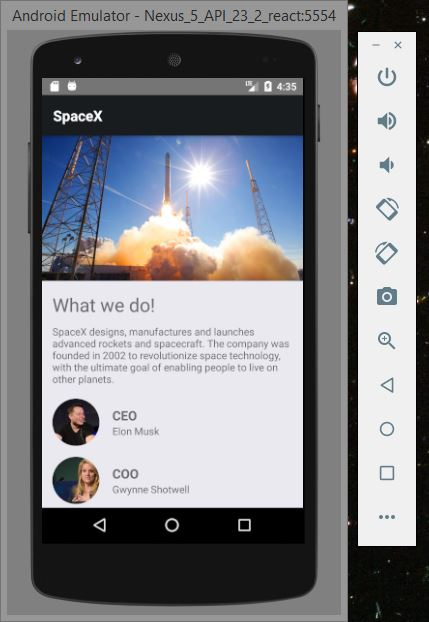
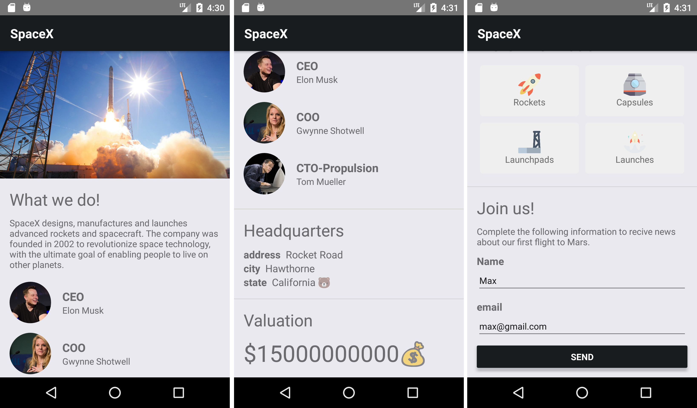

# spacex-landing

Landing page de prueba con temática de SpaceX usando React Native.

## Ejecutar proyecto

Para ejecutar el proyecto se deben tener las dependencias y configuraciones indicadas en la página de [Building Projects with Native Code](https://facebook.github.io/react-native/docs/getting-started.html). Una vez instaladas las dependencias y hechas las configuraciones necesarias, basta con abrir un `Android Emulator` desde `Android Studio` y ejecutar el siguiente comando en la carpeta del proyecto.

```
react-native run-android
```



## Realización del proyecto

Se decidió probar React Native mediante una App que mostrara un landing page de prueba con temática de SpaceX. Para ello, se tomó como referencia el [API](https://github.com/r-spacex/SpaceX-API/wiki) publica de esta compañía para la realización de los diseños y consumo de datos en la aplicación. 

### Wireframes

Se realizaron una serie de wireframes para tener una idea aproximada del diseño y contenidos de la App. Estos bocetos se hicieron en papel y sobre ellos se tomó nota de las posibles interacciones, pantallas y navegación dentro de la aplicación.


### Implementación

Para la implementación de las interfaces se emplearon componentes `react-native` comunes a ambas plataformas (Android e iOS), y para la navegación entre pantallas se utilizó [react-navigation](https://reactnavigation.org/).



### Realización de componentes

Una vez implementadas las interfaces se identificaron aquellos fragmentos de código que se pudieran utilizar y se procedió a realizar componentes reutilizables dentro de la App. Se realizaron en total 9 componentes, los cuales se describirán posteriormente en el video demo del proyecto.

### Consumo de datos

Finalmente, con las interfaces implementadas se procedió con la definición del consumo de datos desde el [API](https://github.com/r-spacex/SpaceX-API/wiki) publica de SpaceX. Esto se llevo a cabo mediante el [API Fetch](https://developer.mozilla.org/es/docs/Web/API/Fetch_API) de JavaScript.

```javascript
async componentDidMount() {
  const response = await fetch('https://api.spacexdata.com/v2/launches');
  const launches = await response.json();
  this.setState({ isLoading: false, launches });
}
```


